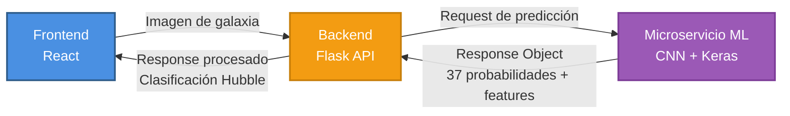
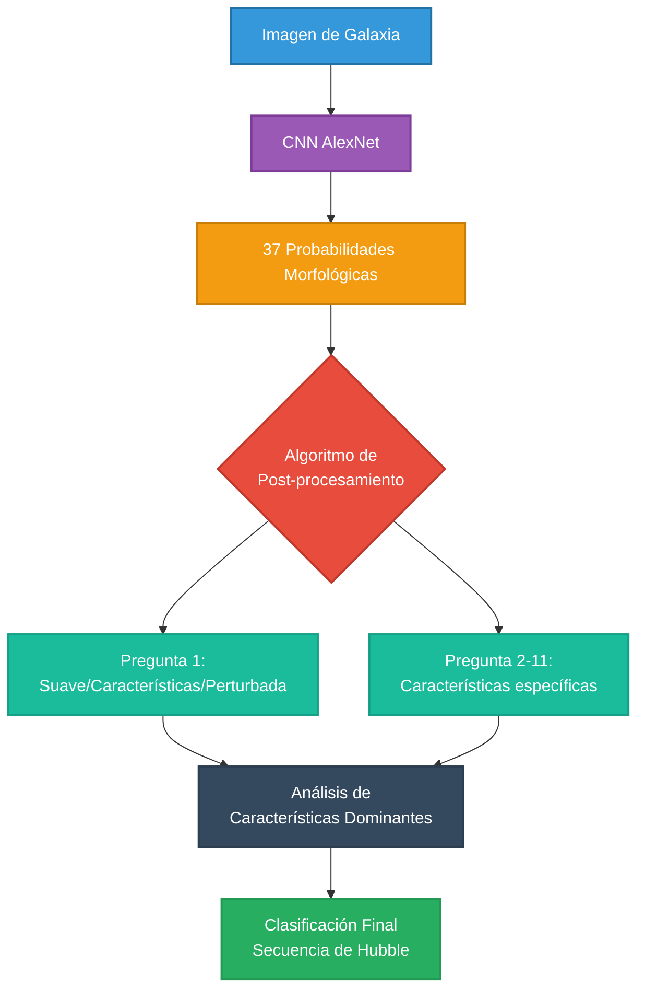

# Clasificador de Galaxias con CNN

## 📋 Descripción del Proyecto

Sistema de clasificación de galaxias basado en Deep Learning que utiliza una Red Neuronal Convolucional (CNN) para categorizar galaxias según la secuencia de Hubble. El proyecto implementa una arquitectura completa con frontend, backend y microservicio de predicción utilizando el dataset Galaxy Zoo 2.

## 🎯 Objetivos

- Predecir características morfológicas de galaxias utilizando CNN
- Clasificar galaxias según la secuencia de Hubble a partir de las probabilidades morfológicas
- Implementar un modelo entrenado con el dataset Galaxy Zoo 2
- Desarrollar una aplicación web interactiva para realizar predicciones en tiempo real
- Diseñar una arquitectura escalable con microservicios

## 🏗️ Arquitectura del Sistema




### Flujo de Datos

1. **Frontend**: El usuario carga una imagen de galaxia
2. **Backend**: Recibe la imagen y la envía al microservicio ML
3. **Microservicio ML**: La CNN procesa la imagen y genera **37 probabilidades** correspondientes a características morfológicas (11 preguntas de Galaxy Zoo 2)
4. **Backend**: Procesa las probabilidades morfológicas y las utiliza para clasificar la galaxia según la secuencia de Hubble
5. **Frontend**: Muestra tanto las probabilidades morfológicas como la clasificación de Hubble resultante

## 🔬 Modelo de Machine Learning

### Dataset
- **Fuente**: Galaxy Zoo 2
- **Tipo**: Imágenes de galaxias con clasificaciones morfológicas crowdsourced
- **Preprocesamiento**: Normalización, redimensionamiento, data augmentation
- **División**: Training set, Validation set
- **Formato de etiquetas**: 37 probabilidades (multi-label) correspondientes a características morfológicas

### Arquitectura del Modelo

#### Red Neuronal Convolucional (CNN)
- **Arquitectura base**: Inspirada en AlexNet
- **Capas Convolucionales**: 5 capas con filtros progresivos
- **Pooling**: Max Pooling después de capas específicas
- **Fully Connected**: 3 capas densas
- **Capa de salida**: 37 neuronas con activación Sigmoid (multi-label)
- **Función de activación**: ReLU (capas ocultas), Sigmoid (capa de salida)
- **Regularización**: Dropout para prevenir overfitting
- **Optimizador**: Adam
- **Loss Function**: Binary Crossentropy (apropiada para clasificación multi-label)
- **Métricas**: Accuracy
- **Épocas de entrenamiento**: 20
- **Batch Size**: 32
- **Callbacks**: Checkpoint cada 50 épocas

#### Salida del Modelo: 37 Probabilidades Morfológicas

**Aspecto clave**: La CNN no clasifica directamente según la secuencia de Hubble. En su lugar, predice **37 probabilidades independientes** que corresponden a las respuestas de las **11 preguntas morfológicas de Galaxy Zoo 2**. 

Se utiliza **Binary Crossentropy** como función de pérdida porque cada característica morfológica es una predicción independiente (clasificación multi-label), no mutuamente excluyente.

**Preguntas de Galaxy Zoo 2:**
1. ¿La galaxia es suave, tiene características o está perturbada?
2. ¿Podría identificarse como espiral?
3. ¿Qué tan ajustados están los brazos espirales?
4. ¿Cuántos brazos espirales hay?
5. ¿Hay alguna protuberancia en el centro?
6. ¿Qué tan prominente es la protuberancia central?
7. ¿Hay algo extraño?
8. ¿La galaxia está redondeada?
9. ¿Qué tan redondeada es?
10. ¿Hay una barra en el centro?
11. ¿Es una galaxia de canto (edge-on)?

Cada pregunta tiene múltiples opciones de respuesta posibles, sumando un total de 37 probabilidades de salida.

### Clasificación según Hubble Sequence

**Post-procesamiento**: Utilizamos las 37 probabilidades morfológicas predichas por la CNN para determinar la categoría en la secuencia de Hubble mediante un algoritmo de clasificación basado en reglas que interpreta las características morfológicas.

**Categorías de Hubble:**
- **Elípticas (E)**: E0, E3, E5, E7
- **Lenticulares (S0)**: S0
- **Espirales (S)**: Sa, Sb, Sc, Sd
- **Espirales Barradas (SB)**: SBa, SBb, SBc, SBd
- **Irregulares (Irr)**: Irr

### Pipeline Completo de Clasificación



## 🛠️ Tecnologías Utilizadas

### Frontend
- **Framework**: React
- **Manejo de estado**: React Hooks
- **HTTP Client**: Axios / Fetch API
- **UI/Styling**: CSS Modules / Styled Components

### Backend
- **Framework**: Flask (Python)
- **API**: REST
- **Manejo de archivos**: Werkzeug

### Microservicio ML
- **Framework Deep Learning**: TensorFlow + Keras
- **Procesamiento de datos**: Pandas, NumPy
- **Procesamiento de imágenes**: OpenCV / Pillow
- **Servidor**: Flask
- **Lenguaje**: Python 3.8+

### Otras herramientas
- Docker (containerización)
- Git (control de versiones)

## 📦 Instalación

### Requisitos Previos
```bash
- Python 3.8+
- Node.js 14+
- [Otros requisitos]
```

### Configuración del Backend
```bash
cd backend
pip install -r requirements.txt
python app.py
```

### Configuración del Microservicio ML
```bash
cd ml-service
pip install -r requirements.txt
python model_service.py
```

### Configuración del Frontend
```bash
cd frontend
npm install
npm run dev
```

## 🚀 Uso

1. Iniciar el microservicio ML en el puerto 5001
2. Iniciar el backend en el puerto 5000
3. Iniciar el frontend en el puerto 3000
4. Acceder a `http://localhost:3000`
5. Cargar una imagen de galaxia
6. Obtener la clasificación según la secuencia de Hubble

## 📊 Resultados

### Métricas del Modelo
- **Accuracy**: [X%]
- **Loss**: [X]
- **Validación**: [Describir resultados]

### Ejemplos de Predicciones
[Incluir capturas de pantalla o ejemplos]

## 👥 Equipo IA Chad

Proyecto desarrollado por el equipo **IA Chad** como parte del curso de Proyecto en la Universidad Nacional de Río Cuarto (UNRC).

- [Alfonso David] - [Rol: CNN Development & Model Training]
- [Budin Lautaro] - [Rol: ML Microservice Architecture & Integration]
- [Debernardi Alvaro] - [Rol: React UI & User Experience]
- [Dellafiore Leon] - [Rol: React UI & User Experience]
- [Cuesta Mateo] - [Rol: Flask API & Service Orchestration]
- [Venier Andres] - [Rol: Flask API & Service Orchestration]


## 📚 Referencias

- Galaxy Zoo 2: Willett et al. (2013)
- Hubble Sequence: Hubble, E. (1926)

## 📄 Licencia

Este proyecto fue desarrollado con fines académicos como parte de la materia Proyecto en la Universidad Nacional de Río Cuarto (UNRC).

MIT License - Copyright (c) 2024-2025 Equipo IA Chad

---

**Universidad**: Universidad Nacional de Río Cuarto (UNRC)  
**Materia**: Proyecto  
**Equipo**: IA Chad  
**Año**: 2024-2025
